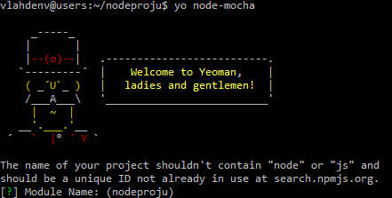

# Aloittaminen

Nodea pystyy ajamaan laitoksen users-palvelimella (`users.cs.helsinki.fi`). **Mutta valitettavasti siellä ei voi käyttää websocketteja**, koska laitoksen Apache ei tue websocketteja.

Siispä kannattaa ehkä katsoa [Noden ajaminen Herokussa](#noden-ajaminen-herokussa).

## Noden ajaminen laitoksen palvelimella

 * [Lue ohjeet.](http://users.cs.helsinki.fi/README.users.cs.helsinki.fi.txt)
 * Suorita `wanna-htdocs`.
 * Luo tiedosto `~/htodcs/.htaccess`.
 * Luo uudelleenohjaus Apachelta Nodelle:

```apache
RewriteEngine On
RewriteRule ^(.*)$ http://TUNNUS.users.cs.helsinki.fi:PORTTI/$1 [P]
```

 * Tunnus on oma AD-tunnuksesi ja portti on joku portti vaikka väliltä 30000 - 40000
   * Node-ohjelmasi tulee kuuntelemaan tätä porttia, ei porttia 80!
 * Jos sinulla on jo jotain users-palvelimella, niin htaccess tiedoston voi lisätä myös alikansioon.
 * Aseta oikeudet kotikansiolle, htdocsille ja htaccessille linkattujen ohjeiden mukaan.
 * Nyt Noden pitäisi toimia, testaa suorittamalla `node` ja ajamalla seuraava ohjelma (korvaa PORTTI omallasi)

```javascript
var http = require('http');
http.createServer(function (req, res) {
  res.writeHead(200, {'Content-Type': 'text/plain'});
  res.end('Hello World\n');
}).listen(PORTTI);
```

 * Nyt http://TUNNUS.users.cs.helsinki.fi/ pitäisi sanoa `Hello World!`

Huom. Sovellusta ei kannata laittaa `htdocs`-kansioon, kannattaa luoda sille oma kansio kotikansioon: `mkdir ~/nodeprojunnimi`

## Noden ajaminen Herokussa

 * Aloittaminen: https://devcenter.heroku.com/articles/getting-started-with-nodejs
 * Websockettien käyttö: https://devcenter.heroku.com/articles/node-websockets

TODO: pull requesteja otetaan vastaan. :)

## Sovelluksen rakenne

Tässä on esimerkki pienestä projektistani [NodePieSpy](https://github.com/tuhoojabotti/NodePieSpy):sta.

```
├── example               # koodiesimerkkejä ohjelman käytöstä, ei välttämätön
│   └── example.js
├── lib                   # itse projektin koodit
│   ├── algorithms        # pieniä moduuleja, joita käytetään koodissa
│   │   ├── bfs.js
│   │   ├── cluster.js
│   │   ├── to-list.js
│   │   └── to-matrix.js
  ...
│   ├── analyser.js       # pääluokka, jossa suurin osa sovelluslogiikasta
│   ├── api.js            # express-frameworkkia käyttävä web-palvelin, joka tarjoaa HTTP API:n analyserille
│   └── parser.js         # pieni moduuli, jota analyser käyttää irkkilogien parsimiseen
├── test                  # testit, tietenkin
│   └── analyser.test.js
├── Gruntfile.js          # gruntfile, kuin makefile, kannattaa myös katsoa gulp, se on ehkä helpompi.
├── index.js              # pääohjelma, sitä ei laiteta lib-kansioon
├── package.json          # ohjelman metatiedot
└── README.md
```

### lib

Tänne on tarkoitus laittaa pieniä moduuleja ja "luokkia", jotka toimivat järkevästi yhteistyössä.

### index.js

Täällä on tarkoitus ladata `lib`-kansiosta tarvittavat ja käynnistää sovellus. Tänne ei ole tarkoitus kirjoittaa suurta määrää koodia.

### [Gruntfile.js](http://gruntjs.com/getting-started)

Suosittelen myös tutustumaan [Gulp](https://github.com/gulpjs/gulp/blob/master/docs/getting-started.md#getting-started):iin. Gulp on uudempi ja vaikuttaa yksinkertaisemmalta kuin Grunt, mutta siitä ei ole vielä kokemusta.

### [package.json](http://package.json.nodejitsu.com/)

[npm](https://www.npmjs.org/) on Noden paketinhallintajärjestelmä, eli sillä hoidellaan sovelluksen riippuvuudet, jotka löytyy package.json-tiedostosta. Sinne kannattaa lisätä myös projektin metatietoja, niitä tarvitsee viimeistään, jos haluaa julkaista moduulin npm:ssä.

## Yeoman



[Yeoman](http://yeoman.io/) on työkalu, jolla on tarkois nopeasti päästä liikkeelle projektin kanssa ilman, että täytyy käyttää tolkuttomasti aikaa alkutoimiin, kuten työkalujen asenteluun ja konffaamiseen.

Laitoksen palvelimella vaatii tosin vähän säätöä:
 * Jotta voit asentaa npm-moduuleja "globaalisti"
   * `npm config set prefix ~/npm`
   * `echo 'export PATH=$HOME/npm/bin:$PATH' >> ~/.bashrc`
 * Jotta Yeoman löytää asennetut generaattorit
   * `echo 'export NODE_PATH=$NODE_PATH:$HOME/npm/lib/node_modules' >> ~/.bashrc`
 * Tämän jälkeen käynnistä komentorivi uudestaan.

### Gruntfilen luominen

 * Asenna Yeoman `npm install -g yo`
 * Asenna gruntfile generaattori `npm install -g generator-gruntfile`
 * Ellet ole jo projektihakemistossa `cd nodeproju`
 * Suorita generaattori `yo gruntfile`
 * Asenna luodut riippuvuudet `npm install`
 * Asenna Grunt `npm install -g grunt-cli`

Yeoman generaattorimme loi meille valmiin Gruntfilen, jossa on valmiiksi `jshint`, `nodeunit` ja `watch` -toiminnot.

Voit testailla niitä kutsumalla `grunt` (suorittaa default-taskin) tai `grunt jshint`:
```
:~/nodeproju$ grunt
Running "jshint:gruntfile" (jshint) task
>> 1 file lint free.

Running "jshint:lib_test" (jshint) task
>> 0 files linted. Please check your ignored files.

Running "nodeunit:files" (nodeunit) task
Warning: 0/0 assertions ran (0ms) Use --force to continue.

Aborted due to warnings.
```

### Yeoman-generaattorit

Kannattaa tutustua Yeomanin yhteisön tarjoamiin [generaattoreihin](http://yeoman.io/community-generators.html) ja etsiä sieltä kiva, millä pääsee nopeasti vauhtiin.


